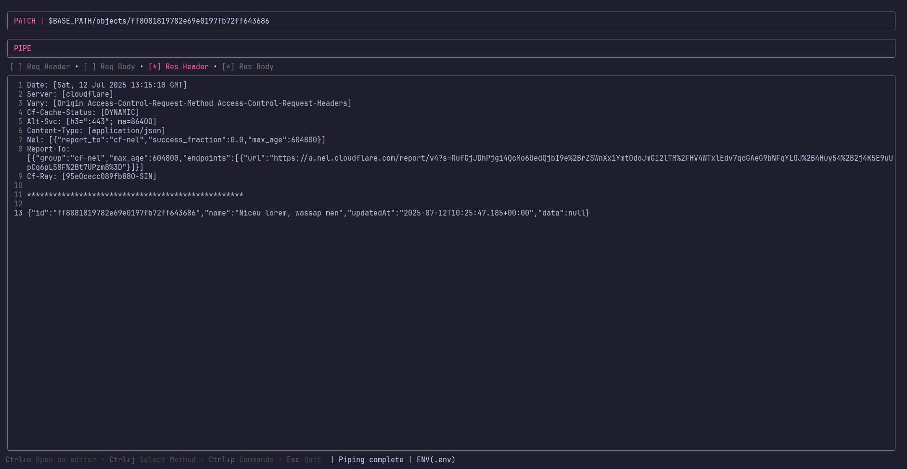
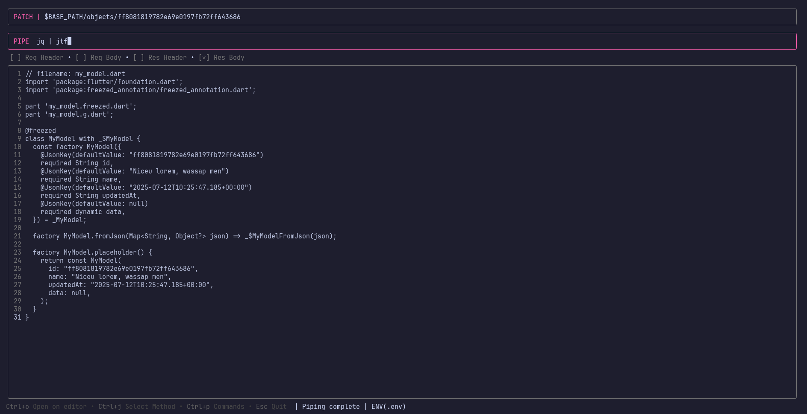
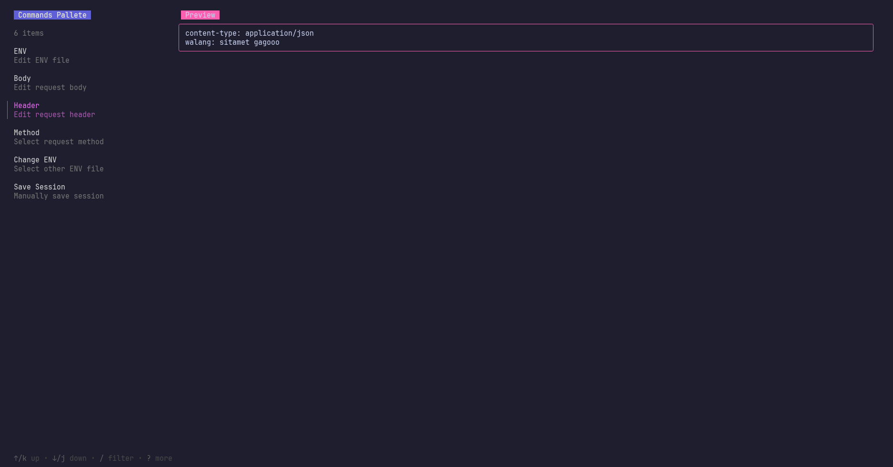

# Mayohttp

A TUI HTTP client written in Go with Pipelines on mind.

## Main features

- Terminal pipelines
- Filtering response before pipe-ing (eg. req header, req body, res header, res body)
- Sessions
- Environment file
- You can use env variables literally on anything (url, pipe, response, header) with $NAME syntax
- Open / Edit anything with your favorite editor (set the $EDITOR on your environment)
