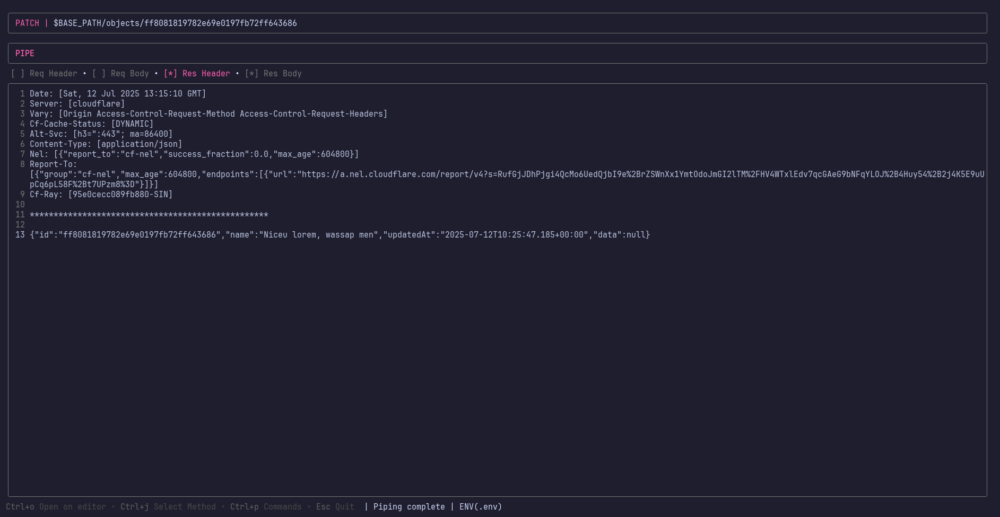
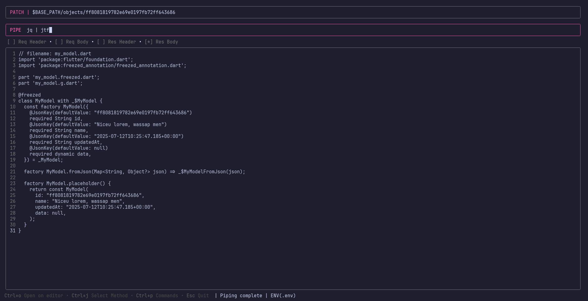
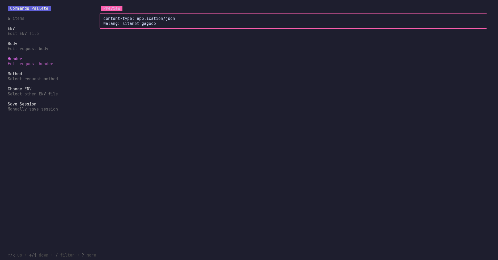

# Mayohttp

A TUI HTTP client written in Go with Pipelines on mind.






## Table of Contents
- [Main features](#main-features)
    - [URL Compose](#url-compose)
- [Installation](#-automatic-install-recommended)
    - [🚀 Automatic Install (Recommended)](#-automatic-install-recommended)
    - [✋ Manual Install (Alternative)](#-manual-install-alternative)
- [Neovim Plugin](#neovim-plugin)

## Main features

- Terminal pipelines
- Filtering response before pipe-ing (eg. req header, req body, res header, res body)
- Sessions
- Environment file
- You can use env variables literally on anything (url, pipe, response, header) with $NAME syntax
- Open / Edit anything with your favorite editor (set the $EDITOR on your environment)
- URL Compose

## URL Compose

URL Compose is a feature that allows you to compose the URL easily and quickly (to open it, press `<c-u>`), it's still experimental yet and any feedback are welcomed


- `cd {val}` to change the path (e.g `cd ..` to go up one level, cd `/` to go to root, cd `testing` to add `testing` to the pathname)
- `{number}={val}` to change the pathname at the index with the value
- `{key}={val}` to add or change (if already exists) a query param
- `rm {key|number}` to remove a query param or pathname at specific index

> [!NOTE]
> The index 0 is preserved for the protocol (http, https etc), just like pathname, you can use `0=http` to set it or `rm 0` to remove it

## 🚀 Automatic Install (Recommended)
> [!IMPORTANT]  
> ✅ Supported OS: Linux and MacOS

```bash
# use curl
$ curl -fsSL https://raw.githubusercontent.com/Cybernetics354/mayohttp/main/.scripts/install.sh | sh

# use wget
$ wget -qO- https://raw.githubusercontent.com/Cybernetics354/mayohttp/main/.scripts/install.sh | sh
```

### ⚙️ Installation parameters
| Variable      | Parameter       | Example                                                     | Remarks                                               |
|---------------|-----------------|-------------------------------------------------------------|-------------------------------------------------------|
| `VERSION`     | `--version`     | `VERSION=v0.0.2` or<br>`--version v0.0.2`                   | Install specific version (default: latest release)    |
| `DESTINATION` | `--destination` | `DESTINATION=/usr/bin` or<br>`--destination /usr/local/bin` | Install to custom directory (default: `~/.local/bin`) |

Example:
```bash
$ export VERSION=v0.0.2
$ export DESTINATION=/usr/bin
$ curl -fsSL https://raw.githubusercontent.com/Cybernetics354/mayohttp/main/.scripts/install.sh | sh

# 😎 single liners
$ curl -fsSL https://raw.githubusercontent.com/Cybernetics354/mayohttp/main/.scripts/install.sh | VERSION=v0.0.2 DESTINATION=/usr/bin sh
```

## ✋ Manual Install (Alternative)
If you prefer, you can install manually by hand:

1. Go to the [GitHub releases page](https://github.com/Cybernetics354/mayohttp/releases)

2. Download the asset matching your OS and architecture, e.g.:
```
mayohttp_0.0.2_linux_amd64.tar.gz
```

3. Download the checksum file:
```
mayohttp_0.0.2_checksums.txt
```

4. Verify the checksum:
```bash
$ grep " mayohttp_0.0.2_linux_amd64.tar.gz$" mayohttp_0.0.2_checksums.txt | sha256sum -c -
```

5. Extract the archive:
```bash
$ tar -xzf mayohttp_0.0.2_linux_amd64.tar.gz
```

6. Move the executable into your preferred directory:
```bash
$ chmod +x mayohttp
$ mv mayohttp ~/.local/bin/
```

7. If `~/.local/bin` is not in your `PATH`, add it in your `~/.bashrc`, `~/.zshrc` or `~/.profile`:
```bash
$ export PATH="$HOME/.local/bin:$PATH"
```

8. Reload the shell profile:
```bash
$ source ~/.profile
```

## Neovim Plugin

If you use [Neovim](https://neovim.io/), you can install the [mayohttp.nvim](https://github.com/Cybernetics354/mayohttp.nvim) plugin.
